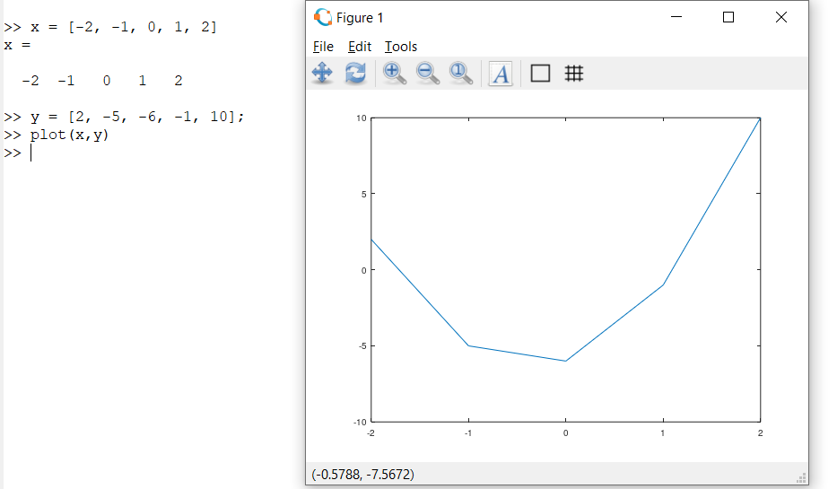
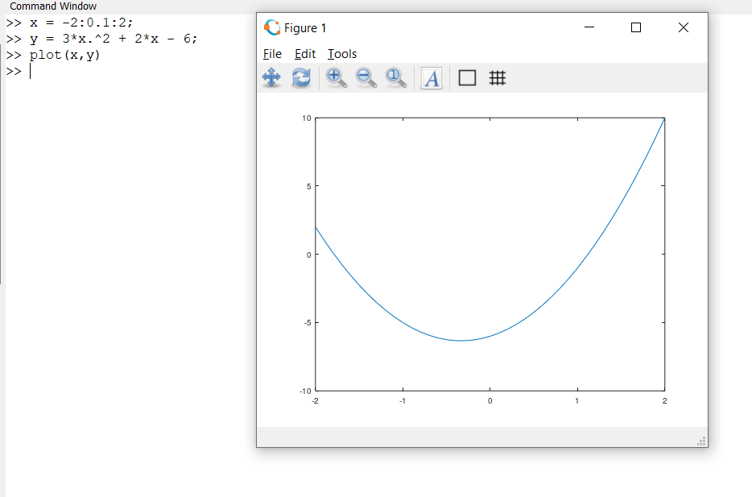

## Row Vector

> x = [-2, -1, 0, 1, 2]

## Column Vector

> x = [-2; -1; 0; 1; 2]

## Plotting Points

> plot(x)

## Uniformly Spaced Vectors

- Inputting a = 0; b = 100; c = a:30:b will print:
  > c = 0 30 60 90
- Spacing by 30

- Inputting a = 0; b = 100; c = linspace(a,b, 10) will print uniformly spaced values:
  > c = 0 10 20 30 40 50 60 70 80 90 100
  >
  > Where 10 is the num of Points

## Accessing elements of a vector using conditions machine learning

https://www.youtube.com/watch?v=8D04GW_foQ0&feature=youtu.be

## Calculations with Vectors

- We cannot performing normal operations like *, /, ^ with vectors, since matlab has been made to work with matrices
- For vectors, we perform element-wise operations: .*, ./, .^

> v1 = [1, 2, 3, 4]
>
> v2 = [2, 4, 6, 8]
>
> v1.*v2 = [1*2, 2*4, 3*6, 4*8]
> v1./v2 = [1/2, 2/4, 3/6, 4/8]
> v1.^v2 = [1^1, 2^4, 3^6, 4^8]

- So the equation  and the value of x = -2:0.1:2; would give 
> y = 3*x.^2 + 2*x - 6;

## Without Vector Calculation
> 

## With Vector Calculation
> 

## Vector Transpose

- Converting the row vector to a column vector or vice-versa.
> c = v';
>
> v is a row vector, c is the new column vector storing the transpose of v