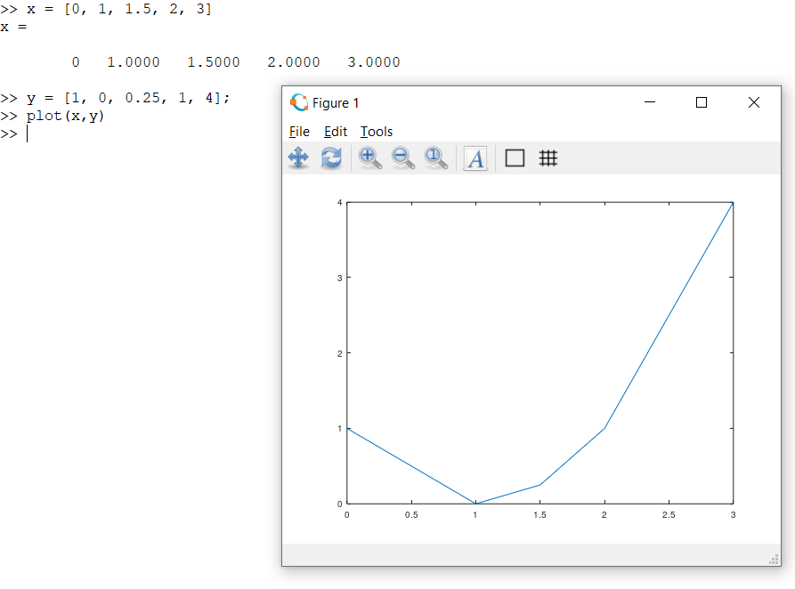
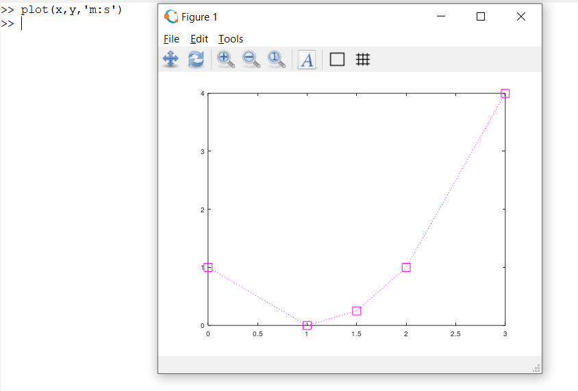
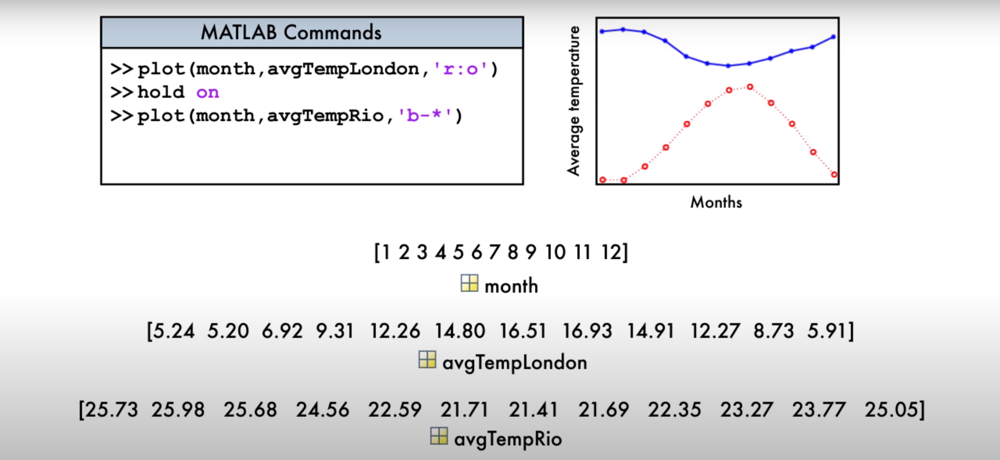
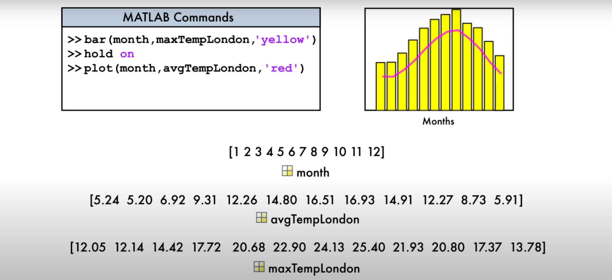

> You can plot vectors using plot function.

> Both vectors need to be of the same size

## plot(x, y)
>

## plot(x, y, 'm:s')
> Plots a graph with magenta lines and the points are represented as squares
>
>

> Other possibilities:
- 'g--*': green dashed line with star markers
- 'r-': red, solid line with no markers

# Annotating the Graph

## Label Axes
- xlabel: labels the x-axis
- ylabel: labels the y-axis

## Add a title
- title

## Add a legend
- legend
- grid
- annotation

# Multiple Plots

- To plot multiple graphs at a time use the hold on syntax
> Below images have been taken from : https://www.youtube.com/watch?v=fBx8EFuXFLM&feature=youtu.be
> 
> 
