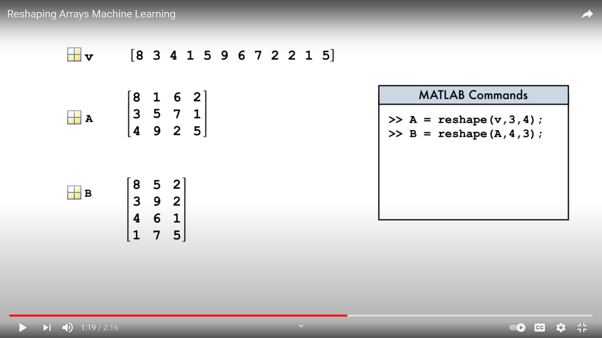

# Creating Matrices
> M = [1, 2, 3; 4, 5, 6];
If you leave out a blank value in the matrix, for example if the above matrice was [1, 2, 3; 4, 5] an error would be returned

# Matrix Calculations
Matrix-Vector calculations or same size matrix calculations are done using element-wise operations, similar to vector calculations
Matrix-Matrix calculations are done using *

# Accessing elements of a Matrix
> row = [1 5];
>
> col = 2:4;
>
> subdata = data(rows, cols);

By this we will access elements of rows 1 and 5 and columns from 2 to 4.

### Simpler way
> col1 = data(:, 1); # select all rows from first column

# Creating Matrices

Large matrices can be created in the following manner
> I = eye(10)
I =

Diagonal Matrix

   1   0   0   0   0   0   0   0   0   0
   0   1   0   0   0   0   0   0   0   0
   0   0   1   0   0   0   0   0   0   0
   0   0   0   1   0   0   0   0   0   0
   0   0   0   0   1   0   0   0   0   0
   0   0   0   0   0   1   0   0   0   0
   0   0   0   0   0   0   1   0   0   0
   0   0   0   0   0   0   0   1   0   0
   0   0   0   0   0   0   0   0   1   0
   0   0   0   0   0   0   0   0   0   1

List of functions for creating large matrices are:

> Commands rand, ones, zeros can take 2 parameters, for getting rectangular matrices

# Combining matrices
## Matrices can be concatenated vertically using 
> [matrix1; matrix2];
provided that matrix1 and matrix2 have the same number of columns.
## Matrices can be concatenated horizontally using 
> [matrix1, matrix2];
provided that matrix1 and matrix2 have the same number of rows.

# Determining Array Size
## You can view the size of a vector or a matrix using
> length(matrix/vector) function

However for a matrix, this will return the larger length between rows and columns.

So for matrices,  you use
> size(matrix)
which stores a tuple value, first for rows and second for columns
Syntax:
> [nrows, ncols] = size(matrix)

# Reshaping Arrays
Use the reshape function.
> v = [8 3 4 1 5 9 6 7 2 2 1 5]
>
> A = reshape(v, 3, 4)

This will resize the 12x1 vector array into a 3x4 matrix.
Note that the matrix will have data stored column wise, that is the output of the above example is:

> A =   [[8, 1, 6, 2]
>
>        [3, 5, 7, 1]
>
>        [4, 9, 2, 5]]

One more way of reshaping the array is by specifying the number of rows/columns you want and leaving the other part [].

> v = [8 3 4 1 5 9 6 7 2 2 1 5]
>
> C = reshae(v, 2, [])

This will create a matrix with 2 rows and n columns, where n is the length of v / no. of rows.

## Creating a vector from a matrix
> newVec = C(:)

This will create a column vector

# Statistical Functions

If we are given a matrix, the rows represent Students and the columns indicate the test score of each student, then
> testAvg = mean(scores)

will return the mean of each column in matrix "scores".

To find the test average of rows, include a second argument

> studentAvg = mean(scores, 2)

Here, 2 indicated the second dimension, that is, the row dimension.

For finding the mean of the whole matrix, convert the matrix into a vector using
> scores(:)

and then apply the mean on the vector

## Other statistical functions

