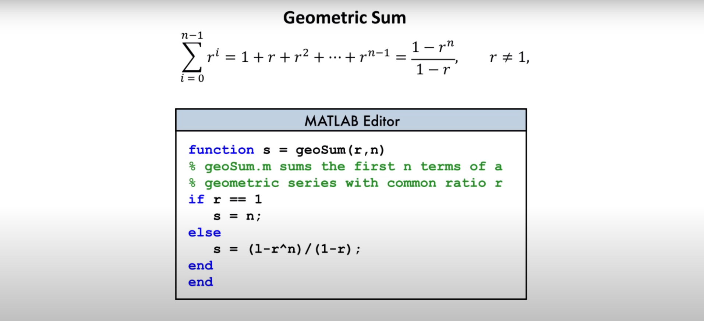

# Logical Variables
> c1 = 10 < 15
c1 will contain the value 1 if the above statement is true, 0 if the above statement is false

## Other Relational Operators

## Logical Operators
Can be used to specify multiple conditions
> c1 = 10 < 15 & 20 < 25
This will return c1 = 1. However,
> c1 = 10 < 15 & 20 > 25
will return c1 = 0.

Logical Operators:
&: and
|: or
~: not

## If-Else statement

# For Loop
Printing values from 0 to 100
>for k = 0:100
>
>   k
>
>end

## While Loop
Prevents a loop from executing more than required
K will stop once it reaches 100
>k = 0
>while k < 100
>
> k = k + 1
>
> end

## Writing Functions
Helps preventing having to execute the same code again and again

We can also store the function in a different file, naming the file after the function name, as such:

## Passing functions as input
Sometimes, certain functions will require you to pass other functions in it.
For example, in order to find the local minimum of a polynomial, we make use of a matlab function called fminsearch.
Fminsearch requires a function as it's first parameter.

To create a function from a equation, we can create an anonymous function
> f = @(x) x^3 - 2*x + 1;

This will make f a function handle that can then be used as an input for fminsearch.

> xmin = fminsearch(f, 1)

However, if you have a function of multiple lines, then store that function in a matlab file, and then create a function handle directly:

