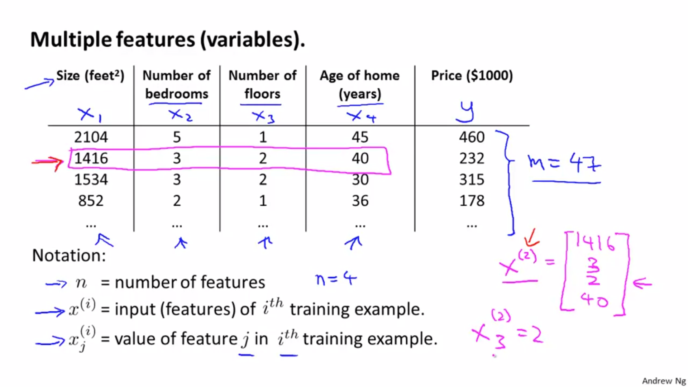

Suppose you have multiple features (variables) 

n = no. of features
 = input features/ row of i'th training example
 = value of feature j in the i'th training example
m = no. of training examples

So now the hypothesis function would become:

where each x is the respective feature for each column. Here we are assuming  to be 1.

Since theta and x, both are **column vectors**, where x = [x0, x1, x2, ..., xn] and theta = [theta0, theta1, ... , thetan], therefore we can write the hypothesis as:

