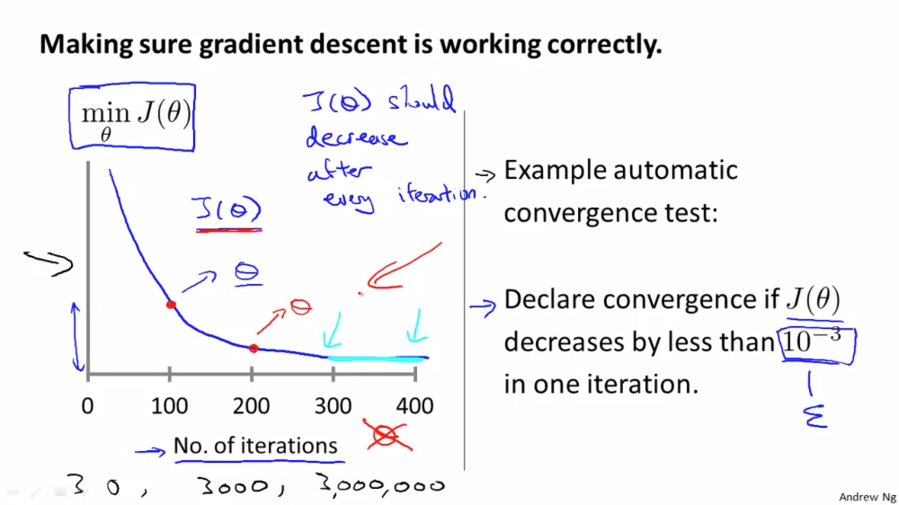

# Practical tricks to make gradient descent work well

## Feature Scaling
In the problem where you have multiple features, make sure that the features are on a similar scale.

## Why?

Let's consider a feature **size of house(0-20000 feet)** and another feature **no. of bedrooms(1-5)**.

If we were the plot the cost function graph it would look very skewed, since the range of **size of house** is a lot larger than the **no. of bedrooms**
This would cause the gradient descent will take a long time navigating it's way through the contours.

However, if we were to scale the features (divide size of house and no. of bedrooms by values so as to scale down the features) then the cost function graph would be more uniform and the gradient descent will be able to easily navigate through the contours to reach the global minimum.

## Mean Normalization
Another method of scaling features is via mean normalization. Take the mean of each feature, subtract each record in the feature by that mean, and divide the outcome by the range. The range can be the standard deviation of the feature, or, if you don't know that, it can be the (max-min) record in the feature.

## Debugging

- How to ensure gradient descent is working correctly
- How to choose the learning rate **alpha**

### How to ensure gradient descent is working correctly

Plot a graph of the cost function J(theta), but instead of plotting it with theta_0 and theta_1, plot it with the number of iterations on the x-axis. As the no. of iterations increases, the graph should start converging, since the cost function should become as minimum as possible. 

### How to choose the learning rate **alpha**

It might happen when you plot the graph of the cost function, the graph is not converging. In this case, it might be that the learning rate **alpha** is too high. In that case, reduce alpha.

Slow convergence is dangerous as well, cause then your graph might not converge even after a million iterations. 

To choose alpha, try ..., 0.001, 0.01, 0.1, 1, ...